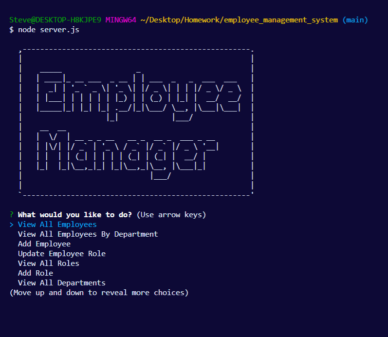

# Employee Management System

## Description 

This project uses the command line to manage a businesses employees.  The user can add and update employees, roles, and departments.

## Table of Contents 

* [Installation](#installation)
* [Usage](#usage)
* [Questions](#questions)

## Installation

User must have node, inpuirer, MySQL installed in order for the application to properly run. 

## Images/Video

## Usage 

A business owner will want to be able to view and manage the departments, roles, and employees in their company so that they can organize and plan the business.

## Questions

You can find other projects that I have worked on at https://github.com/sgalarza419.
If there are any questions you may have please contact me at sgalarza4190@gmail.com.  

---
© 2020 Steven Galarza . All Rights Reserved.
